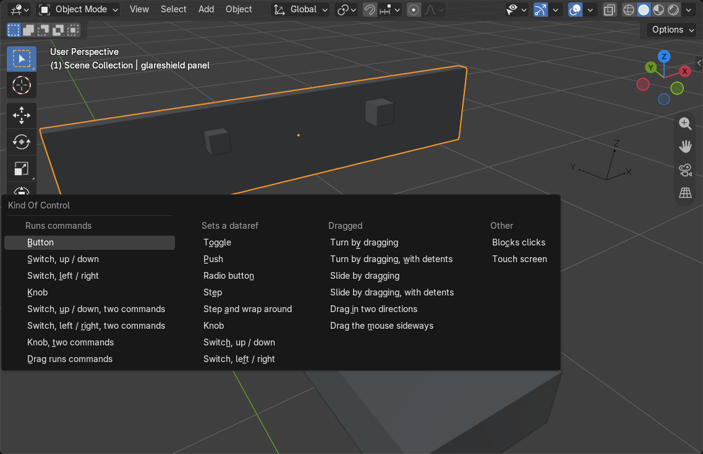
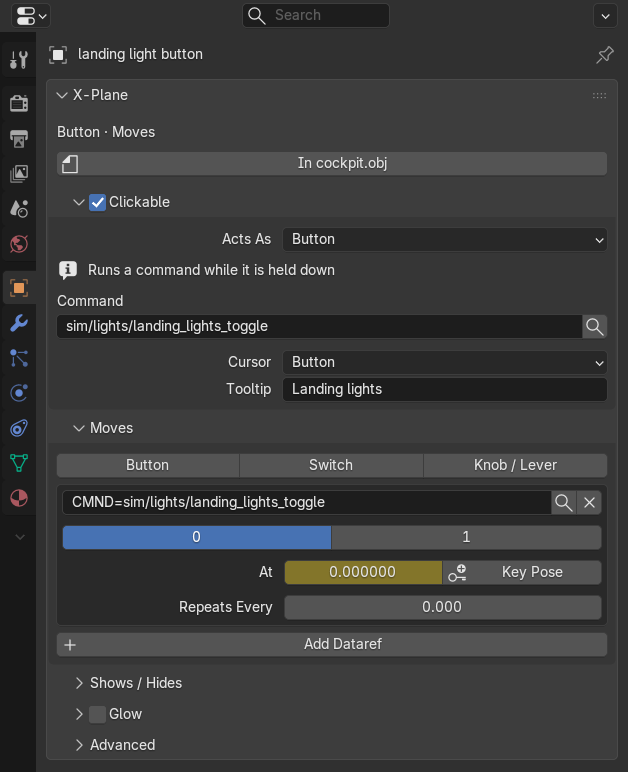
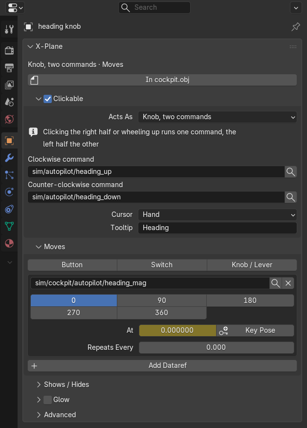
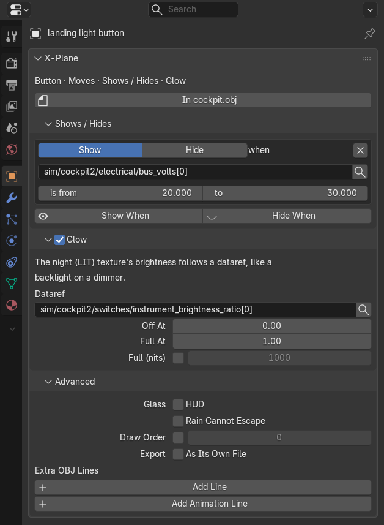
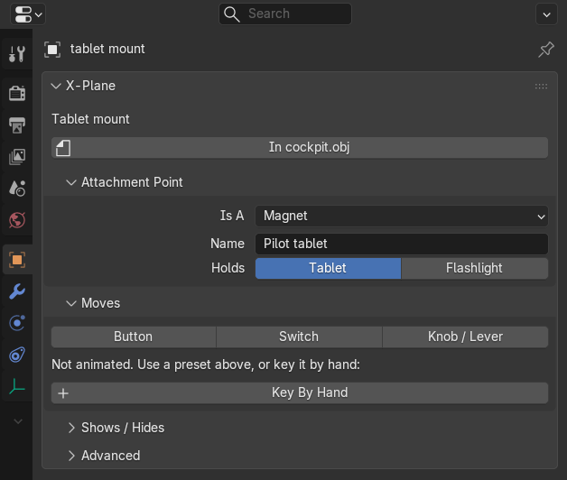
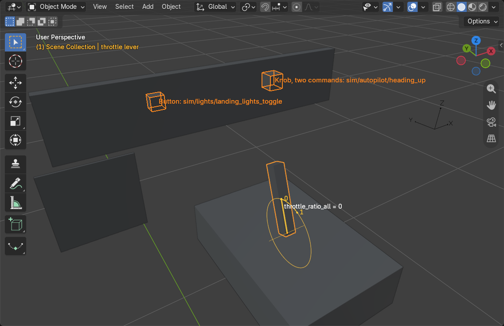

# Cockpit Controls

Select a part and open the **Object tab**. The **X-Plane** panel starts with what the part is in plain words (for
example `Knob, two commands · Moves`), the file it is exported in, and anything that is not filled in yet. Under it is
a card for each thing the part can do. A card whose box is ticked, or that has something in it, is in use.

## Making A Part Clickable

Open **Clickable** and pick **Make Clickable As...**. The menu lists the kinds of control by what they do:

- **Runs commands**: a **Button** runs a command while it is held down, a **Knob, two commands** runs one command on
  the right half or the mouse wheel up and the other on the left half, a **Switch, up / down, two commands** the same
  above and below.
- **Sets a dataref**: a **Toggle** switches a dataref between two values, a **Push** holds a value while it is held,
  a **Radio button** sets one value, a **Step** adds to the dataref on every click, **Step and wrap around** starts again
  at the other end.
- **Dragged**: levers, throttles and sliders that follow the mouse, with or without detents.
- **Other**: **Blocks clicks** for a part that should stop clicks reaching what is behind it.

The card then shows only the settings that kind uses, with what it does in one line. This is a button that toggles the
landing lights:

The search button next to a **Command** or dataref searches X-Plane's own lists and the names this file already uses.
**Cursor** is the mouse pointer X-Plane shows over the part and **Tooltip** the text it shows.

Drags follow their animation: a **Slide by dragging** may have more than two keys along one line (it drags from the
first to the last), and **Turn by dragging, with detents** lifts its detent dataref from 0 to the lift in meters, or
with **Detent Dataref > Own Range** over the range you give. Every setting of every kind is in the
[Settings Reference](reference.md#clickable).

## Making It Move

The **Moves** card animates the part. Three presets key a whole control in one step, on every selected object:

- **Button** moves the button in while its command is held, with a `CMND=` dataref. Leave **Command** empty and each
  button uses its own manipulator command, so a hundred buttons are animated in one click. Buttons that are not
  clickable yet are made clickable (untick **Make Clickable** to skip that). **Pushes Along** and **Travel (mm)** are
  the direction and depth.
- **Switch** gives each of a number of **Positions** a dataref value (**First Value**, **Value Step**) and an angle or a
  distance (**First Position**, **Step**), for toggles, rotary selectors and pull switches.
- **Knob / Lever** follows a dataref from **From Value** to **To Value**, turning or sliding from **From** to **To**.
  **Loop Every** makes an endless knob.

Movement is along or around the object's own axis, from where it stands. Keys are linear, as X-Plane interpolates
them, and turns of more than 90° get keys in between so whole turns are kept. `{name}` in a command or dataref becomes
the object's name. Objects that are already animated are left alone unless **Replace** is ticked.

An animated part lists its datarefs and their keys as buttons. Click a key to go to it, pose the part, type the dataref
value in **At** and click **Key Pose**. **Repeats Every** makes the animation repeat (an endless knob), **Add Dataref**
adds another dataref, and **Key By Hand** starts an animation without a preset. This is the heading knob, a knob with
two commands that turns once around for 0 to 360:

## Showing, Hiding And Backlighting

- **Shows / Hides**: **Show When** or **Hide When** adds a dataref and the range in which the part is shown or hidden,
  here the button is only drawn while the bus has power.
- **Glow**: the night (LIT) texture's brightness follows a dataref, like a backlight on a dimmer, **Off At** and
  **Full At** are its range.
- **Advanced**: **Glass** (**HUD**, **Rain Cannot Escape**), **Draw Order**, levels of detail (**Distances**), exporting
  the part **As Its Own File** from its own origin (a root object), and **Extra OBJ Lines** typed by hand for anything without a setting
  (**Add Line**, **Add Animation Line**).

With several objects selected, the copy button in a card's header copies that card's settings from the active object
to the others (**Copy To Selected**). To copy to many objects one after another, use the **X-Plane Copy** tool, see
[Working Faster](working-faster.md#copying-settings).

## Attachment Points

An empty can be a wheel, a tablet mount for VR or a particle emitter: its **Attachment Point** card sets which
(**Is A**) and what it holds.

## Seeing It In The 3D View

The **Overlays** popover of the 3D View has an **X-Plane** section:

- **Click Zones** outlines everything clickable (orange runs commands, blue sets datarefs, green is dragged), with
  labels that say what a click does, for the selected zones or all of them.
- **Motion** draws the path the selected animated parts travel between their first and last keys, with a tick and the
  dataref value at each key, the hinge line of parts that turn, and `dataref = value` on the active one.
- **Lever Handle** puts a handle on the active animated part: a dial around the hinge of a knob, lever or door, an
  arrow along the slide of a throttle or a seat. Drag it to move the part through its animation as it moves in X-Plane
  and read the dataref value. It only changes the scene frame, nothing is keyed.
- **Lights** rings every X-Plane light, see [Lights](lights.md#seeing-them-in-the-3d-view).
- **Unfinished** outlines in red what the last **Check** listed.

## Bones

The **Bone tab** has the same **Moves**, **Shows / Hides** and **Advanced** cards for an armature's bones, keyed the
same way. Bone animation still has known open issues, check exported bones in X-Plane.
