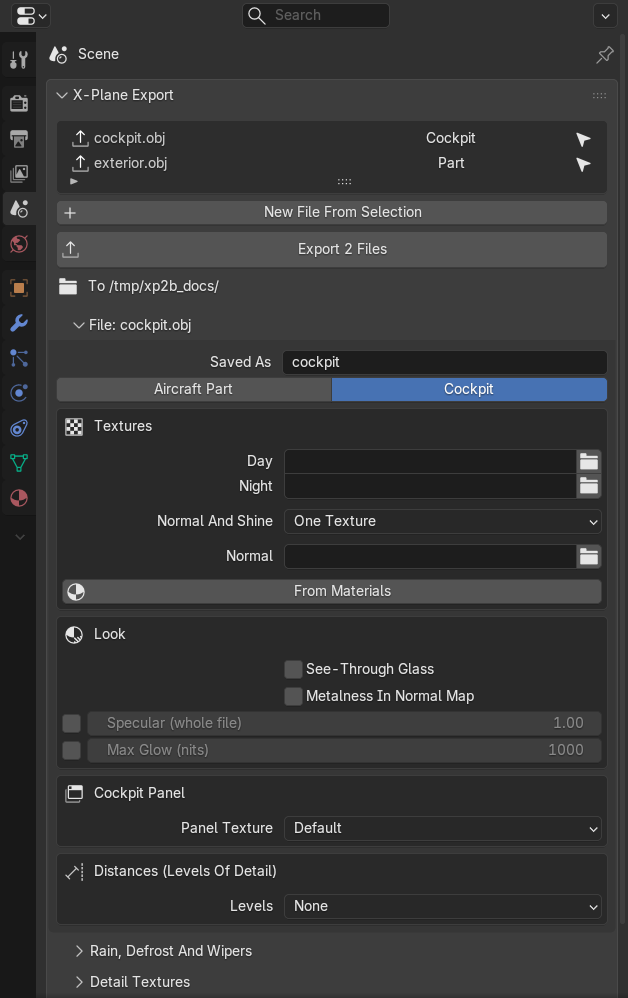
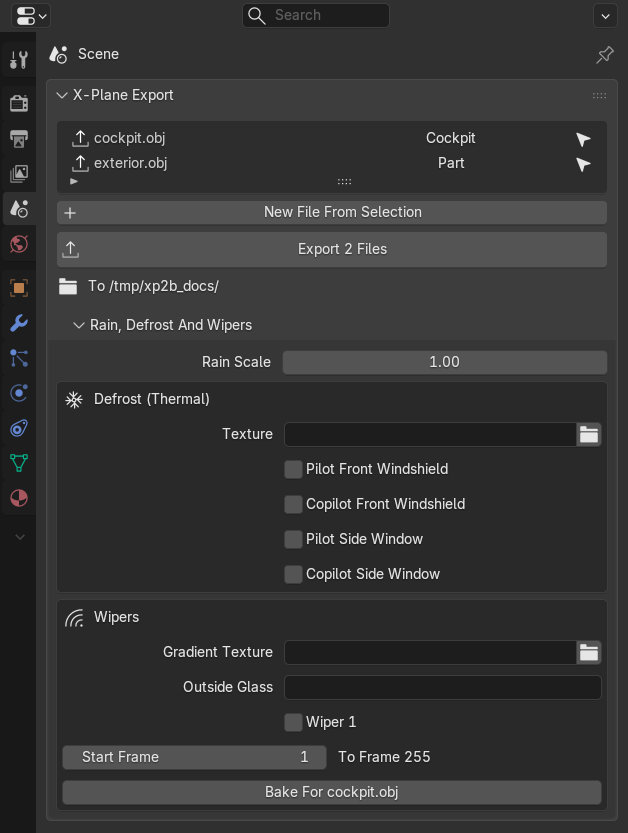
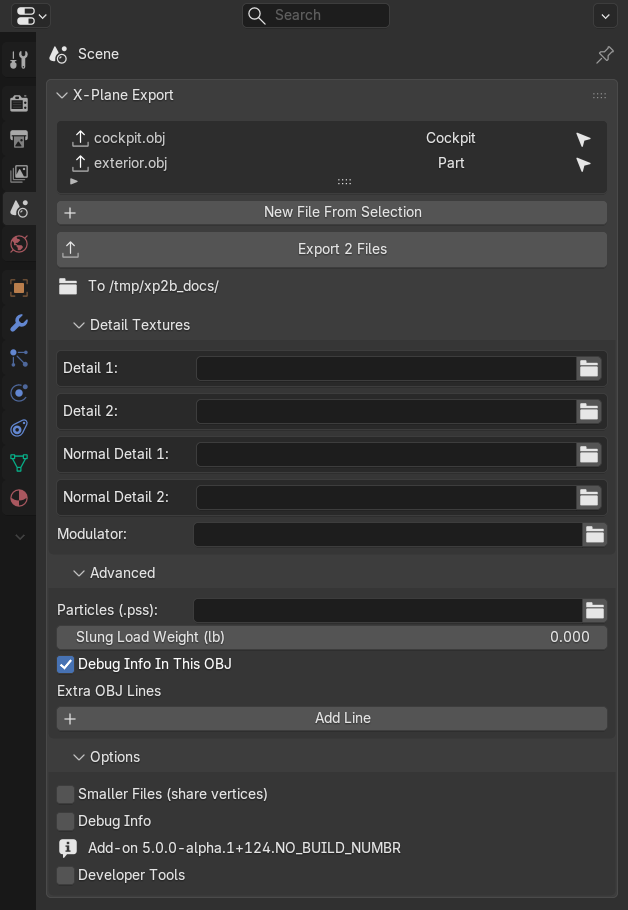
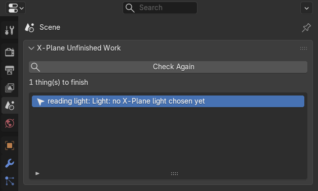

# Files And Export

## Export Files

An export file is a collection with its **X-Plane** box ticked in the **Collection tab**: everything in it is exported as
one OBJ. A single object can also be its own file, from its own origin: tick **Its Own File, From Its Own Origin** in
its **Advanced** card (a root object).

The **Scene tab**'s **X-Plane Export** panel lists the export files of the scene. Tick a file to export it, click
**Cockpit** or **Part** to switch its kind, and the arrow selects its objects. **New File From Selection** puts the
selected objects and their children in a new file. **Export 2 Files** (it counts the ticked files) writes them next to
the .blend file, or, with the path in a file's **Saved As**, below it: the line under the button says where. Until the
.blend is saved the button says **Save The .blend First**. **File > Export > X-Plane Object (.obj)** does the same.

## A File's Settings

Under the list are the settings of the chosen file (or the active object's file):

- **Saved As**: the OBJ's name, and **Aircraft Part** or **Cockpit**. The cockpit OBJ is the one with clickable parts,
  panel textures and camera collision.
- **Textures**: the **Day** and **Night** textures, and how the normal map and shine come in (**Normal And Shine**):
  - **One Texture**: a **Normal** texture with the normal in red and green and the gloss in alpha (and the metalness in
    blue with **Metalness In Normal Map**).
  - **Normal + Metal / Gloss Maps**: X-Plane 12's separate **Normal** map and a **Metal / Gloss** map, the metalness
    in red and the gloss in green.
  - **Normal + Gloss Maps**: the separate **Normal** map and a **Gloss** map, the gloss in red.

  Only the textures of the chosen way are shown and exported, so a file can never mix them. X-Plane draws a whole OBJ
  with one set of textures; **From Materials** fills the empty slots with the images its materials use most.
- **Look**: **See-Through Glass**, **Metalness In Normal Map**, **Specular (whole file)** (the shininess every part has
  unless its material says otherwise) and **Max Glow (nits)**, the brightest the night texture gets.
- **Cockpit Panel**: which **Panel Texture** the 2D panel screens show, and its **Regions**.
- **Distances (Levels Of Detail)**: **Levels** and, for each, the **Near** and **Far** distance in meters.

The sections below them are closed until you need them:

- **Rain, Defrost And Wipers**: **Rain Scale**, the **Defrost (Thermal)** texture with the windows it defrosts, and the
  **Wipers**: their **Gradient Texture**, the **Outside Glass** object, each wiper, and **Bake For** the file, which
  bakes the gradient texture from the wipers' animation between **Start Frame** and the last frame.

- **Detail Textures**: up to two detail textures, two normal detail textures and a **Modulator**. **Preview In
  Viewport** shows them on the file's materials in Material Preview, about as X-Plane draws them.
- **Advanced**: **Particle Systems (.pss)**, **Slung Load Weight (lb)**, **Debug Info In This OBJ** and **Extra OBJ
  Lines** for the file.
- **Options**, for the whole scene: **Smaller Files (share vertices)** writes each vertex once per file, **Debug Info**
  writes comments into the OBJs, and **Developer Tools** are for people working on the add-on itself.

## Exporting Work In Progress

You can export at any stage. Settings you have started but not filled in yet are left out of the OBJ instead of
stopping the export, and the status bar counts them, for example `Exported 10 file(s); left out as unfinished: 2
lights without an X-Plane light chosen`. The full list is in the `X-Plane Export.log` text in Blender's Text Editor. A
file with a real error is not written, but the other files still are, and the status bar says which were skipped.

**X-Plane Unfinished Work** in the **Scene tab** lists what is not filled in yet. Click **Check**, then a line to select
its object:

The **Unfinished** overlay in the 3D View outlines those objects in red.
