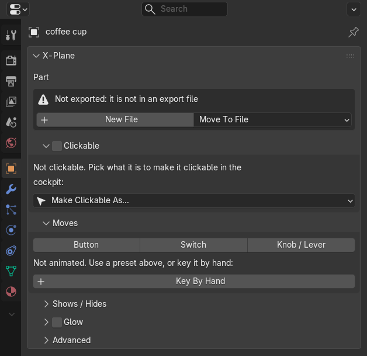
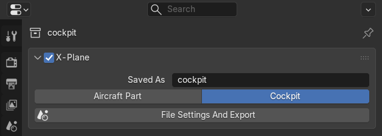

# Getting Started

## Install

1. Download the add-on's `.zip` from the [releases](https://github.com/JonathanOrr/XPlane2Blender/releases), the file
   named like `io_xplane2blender_5_0_0-alpha_15-124_….zip`, not "Source code". Do not unzip it.
2. In Blender open **Edit > Preferences > Add-ons**. In Blender 4.2 and later use the drop-down at the top right and
   **Install from Disk...**, in older versions **Install...**, and pick the `.zip`.
3. Tick **X-Plane 12 Aircraft Tools**. It replaces XPlane2Blender, so do not enable both.
4. Restart Blender.

It works in Blender 3.6, 4.2, 4.5 and 5.2. Files made with XPlane2Blender open and are converted to X-Plane 12 once,
so keep a backup of a file before you open it with this add-on for the first time.

## Where Things Are

Everything is in the **Properties editor**, in an **X-Plane** panel in the tab it belongs to. Each panel shows only
what applies to what is selected:

| Tab | What you set there |
|---|---|
| **Object tab** | What the selected object is in the cockpit: clickable, moving, shown or hidden, glowing, a light or an attachment point. See [Cockpit Controls](cockpit-controls.md) and [Lights](lights.md) |
| **Material tab** | The surface: visible or not, transparency, shadows, screens. See [Materials And Screens](materials-and-screens.md) |
| **Bone tab** | The same moves and shows / hides for an armature's bones |
| **Collection tab** | Whether the collection is exported as an OBJ file |
| **Scene tab** | The list of export files and their settings, and the tools. See [Files And Export](files-and-export.md) |

Blender puts an add-on's panels after its own, so the **X-Plane** panel is at the bottom of the tab. To bring it up,
click its header to close it, then **Ctrl+click** the header: it opens and Blender's own panels in that tab close. Or
drag the panel to the top by the grip at the right of its header. Blender remembers either in the .blend file.

## Your First Export: A Coffee Cup

1. Model or append a cup and give it a material with an image texture.
2. Select it. The **Object tab**'s **X-Plane** panel says what it is and that it is not exported yet, because it is
   not in an export file:

   

3. Click **New File** (in the **Scene tab**'s **X-Plane Export** panel it is **New File From Selection**). Give the
   **File Name**, for example `coffee_cup` (it can also be a path below the .blend's folder, such as
   `cabin/coffee_cup`), and the **Kind**: **Automatic** makes it a **Cockpit** file when something in it is clickable,
   otherwise an **Aircraft Part**. The selected objects and their children go into a new collection that is exported
   as that OBJ, and its textures are filled in from their materials.
4. Save the .blend in your aircraft's `objects` folder: the OBJs are written next to the .blend file.
5. In the **Scene tab**, **X-Plane Export** lists the export files of the scene. Click **Export 2 Files** (it counts
   the ticked files):

   

6. Add the OBJ to the aircraft in Plane Maker (Standard > Objects).

An export file is a collection with its **X-Plane** box ticked in the **Collection tab**. There you choose its name and
whether it is an **Aircraft Part** or the **Cockpit** (the cockpit OBJ is the one with clickable parts and screens):

**File Settings And Export** takes you to the file's settings in the **Scene tab**.

## What Happens To Unfinished Work

You can export at any time. Settings you have started but not finished (a light with no X-Plane light chosen yet, a
mesh without a material) are left out of the OBJ instead of stopping the export, and the status bar says how many. See
[Files And Export](files-and-export.md#exporting-work-in-progress).
