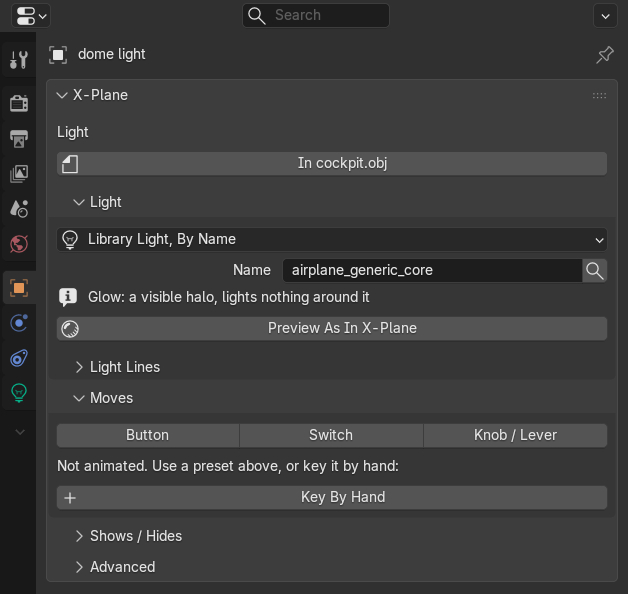
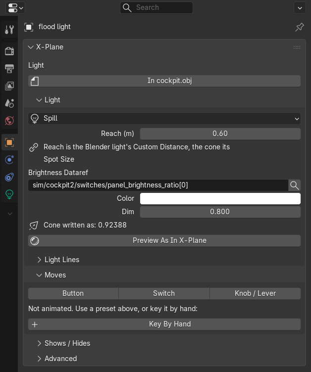

# Lights

Add a Blender light, or use **Shift+A > X-Plane** and pick **Light: Library Light**, **Light: Spill** or **Light: Glow
Sprite**. The **Light** card in the **Object tab** sets what it becomes in X-Plane. **Kind Of Light** has:

| Kind | What X-Plane draws |
|---|---|
| **Library Light** | A light from X-Plane's lights.txt, taking its color and cone from the Blender light |
| **Library Light, By Name** | A light from lights.txt as it is, by its name |
| **Library Light, Manual** | A light from lights.txt with its parameters set by hand |
| **Spill** | A light of your own that lights its surroundings, out to its reach |
| **Glow Sprite** | A halo you draw from a texture, that lights nothing |
| **Not Exported** | Nothing: the light only lights the Blender scene |

## Library Lights

**Choose X-Plane Light** (the search button next to **Name**) lists every light of lights.txt, tagged spill (lights
its surroundings), glow (a visible halo that lights nothing) or both. Under the name the card says what the chosen
light does, or that the name is not in lights.txt:

For **Library Light, Manual** the card has a setting for each parameter the chosen light takes (a color, a direction,
the cone, a size, an index) and the line they make **As Text**, which can also be pasted or edited by hand. A new one
starts with the color, cone and direction of the Blender light.

## Spills

A **Spill** lights what is around it, out to its **Reach (m)**, which is the Blender light's Custom Distance; the cone
of a spot light is its Spot Size. **Brightness Dataref** dims it with a dataref and **Dim** is its brightness (1 is full
brightness, 0 is off until the dataref brightens it).

## The Blender Light And The X-Plane Light Share Their Numbers

You can change either one: a change made on the Blender light is taken into the X-Plane light, and a change made in the
card is passed to the Blender light. The light's rotation is its direction, Spot Size its cone and Color its color;
Power is the intensity in candela, and Custom Distance the reach of a spill. Selecting a light or opening a file never
changes it. The power factor makes a plausible picture, not a measurement: check the brightness in X-Plane.

**Light Lines** below the card holds extra OBJ lines for the light (**Add Line**).

## Seeing Them As X-Plane Draws Them

**Preview As In X-Plane** makes the light look in the viewport the way X-Plane draws it: spills light their
surroundings, custom spills only out to their reach, glow-only lights light nothing. **Preview Every Light As In
X-Plane** in the **Scene tab**'s **X-Plane Tools** does it for every light. It only changes Blender settings the exporter
never reads, so the OBJ stays the same, and Ctrl+Z undoes it.

## Seeing Them In The 3D View

An aircraft has hundreds of lights, and Blender draws each with a line to the ground and, for a spot, a large circle.
The **Lights** overlay (in the **Overlays** popover's **X-Plane** section) draws a ring in each light's color instead
(red when no light is chosen yet), with a tick for the way a spot shines and, for the selected ones, their name and
their reach. **Blender's Light Gizmos** in the pie menu (Blender's **Overlays > Extras**) hides Blender's own drawing
while the lights keep lighting the scene. **Tidy Empties And Light Cones** draws empties at the size of what hangs on them and a spot light's cone only as
long as its reach.
The **Scene tab**'s **X-Plane Tables > Lights** lists every light.

## Old X-Plane 9 Lights

X-Plane 9 lights have no X-Plane 12 equivalent. They keep their place and color, are listed as unfinished work until
an X-Plane 12 light is picked, and are left out of exports until then.
