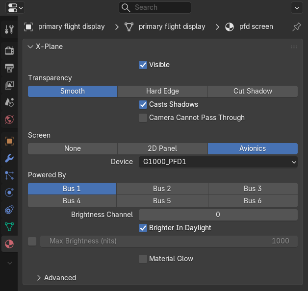

# Materials And Screens

The **Material tab**'s **X-Plane** panel is the surface, shared by every object that uses the material. The exporter
reads an object's first material.

| Setting | What it does |
|---|---|
| **Visible** | Off for invisible click zones: the object is clickable but not drawn |
| **Transparency** | **Smooth** blends with what is behind, **Hard Edge** cuts the texture's alpha at **Cut Off Below**, **Cut Shadow** draws smoothly but cuts its shadow at **Cut Off Below** |
| **Casts Shadows** | Whether the surface casts shadows |
| **Camera Cannot Pass Through** | X-Plane's camera stops at the surface (cockpit files only) |
| **Material Glow** | The night (LIT) texture's brightness follows a dataref, for every object with the material (see Glow in [Cockpit Controls](cockpit-controls.md#showing-hiding-and-backlighting)) |

## Screens

**Screen** makes the surface show the cockpit's 2D panel or an avionics device:

- **2D Panel** shows the aircraft's 2D panel, mapped by the object's UVs. The file's **Cockpit Panel** settings choose
  which panel texture (see [Files And Export](files-and-export.md)).
- **Avionics** shows one of X-Plane's devices (**Device**), or a plugin's. **Powered By** picks the buses that power
  it, **Brightness Channel** the lighting channel (rheostat) that dims it (-1 for none), and **Brighter In Daylight**
  lets X-Plane raise its brightness in daylight.
- **Max Brightness (nits)**, once ticked, is the real-world brightness of the screen at its brightest.

## Advanced

**Hard Surface** makes the surface solid for the aircraft, of a kind (concrete, grass...), and **Can Be Under It
(deck)** lets the aircraft also be under it. **Draw On Top** draws the surface over others at the same place, for
decals. **Add Line** adds extra OBJ lines to everything with the material.

Every setting is in the [Settings Reference](reference.md#material-tab).
