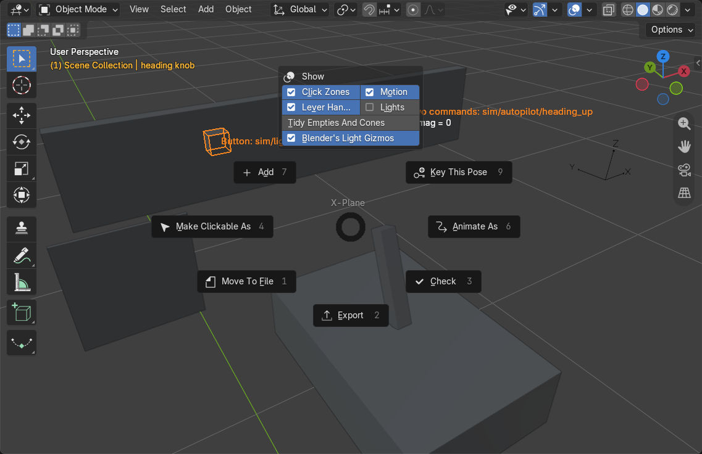
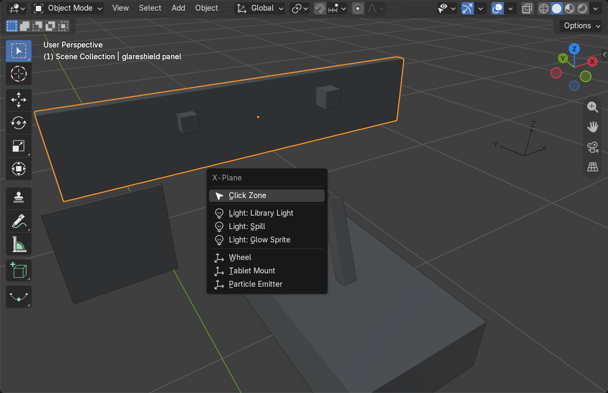
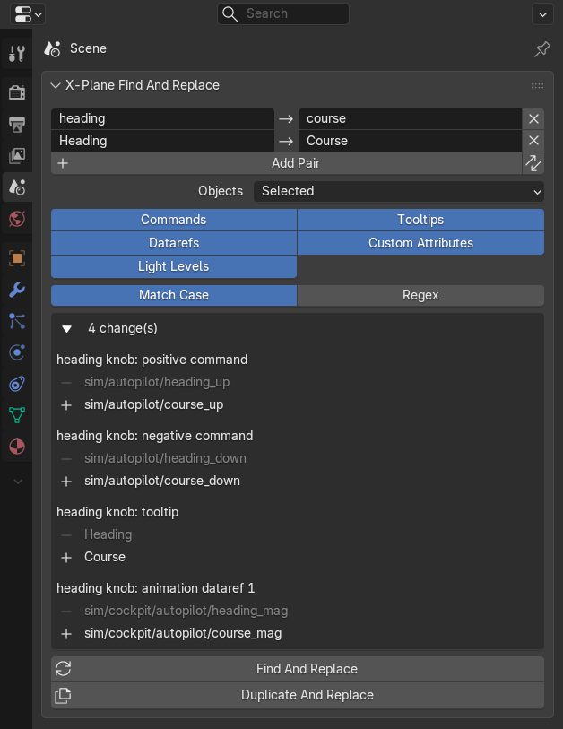
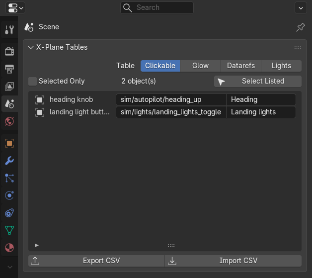
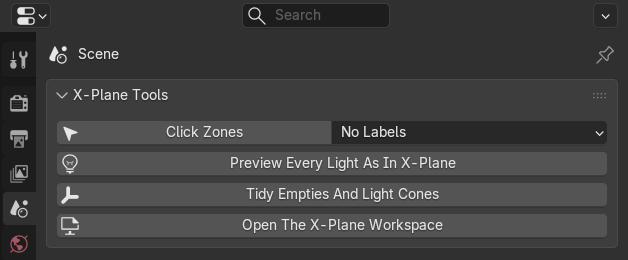

# Working Faster

## The Pie Menu

**Shift+Q** in the 3D View opens the X-Plane pie menu: **Make Clickable As**, **Animate As**, **Add**, **Key This
Pose**, **Move To File**, **Check**, **Export**, and a box with the overlay switches, **Tidy Empties And Cones** and
**Blender's Light Gizmos**. Change the key in **Edit > Preferences > Keymap** (Object Mode).

## Adding Things

**Shift+A > X-Plane** adds an invisible **Click Zone**, a light (**Light: Library Light**, **Light: Spill**, **Light:
Glow Sprite**) or an attachment point (**Wheel**, **Tablet Mount**, **Particle Emitter**) at the 3D cursor:

The 3D View's right-click menu has an **X-Plane** section with **Make Clickable As**, the animation presets and
**Move To File**.

## Copying Settings

**X-Plane Copy** in the toolbar (the stamp): make a finished button, light or attachment point active, then click
every other one to give it the same settings. The tool settings choose what is copied: **Click**, **Glow**, **Shows /
Hides**, **Light**, **Attachment**. To copy one card to all selected objects at once, use the copy button in the
card's header (see [Cockpit Controls](cockpit-controls.md#showing-hiding-and-backlighting)).

## Find And Replace

For the many controls that differ only by side or number. In the **Scene tab**'s **X-Plane Find And Replace**, **Add
Pair** for each text to replace, such as `cockpit/mcdu/` to `cockpit/mcdu_2/` and `Captain` to `First Officer`, choose
which settings to change (commands, datarefs, light levels, tooltips, custom attributes) and which **Objects** (the
selected ones, with their children, or the whole scene). The panel lists every change before you make it:

- **Find And Replace** changes the objects in place.
- **Duplicate And Replace** copies the selection, changes the copies only and lets you move them, like Shift+D: copy
  the captain's MCDU once and the first officer's is done.
- Pairs are applied in order. **Match Case** is on by default, X-Plane's names are case sensitive, and **Regex** allows
  regular expressions with `\1` groups.
- A material or light that objects outside the selection also use is left alone, so changing one side never changes
  the other.
- Ctrl+Z undoes both.

## Tables And CSV

The **Scene tab**'s **X-Plane Tables** lists one kind of setting for every object in one place: **Clickable** (every
click zone), **Glow** (every light level), **Datarefs** (the datarefs that move, show or hide objects) and **Lights**
(every light and what it becomes in X-Plane).

Click a row to select its object, type in the search box to filter by name, command, dataref or light, and **Select
Listed** selects what the list shows, for the other tools to work on together. Widen the Properties editor to edit the
settings in place. **Export CSV** writes every setting of the listed objects to a spreadsheet file and **Import CSV**
reads it back by object name: values that did not change are left alone, and objects that are not found or values that
cannot be used are reported instead of stopping the import.

## Tools

The **Scene tab**'s **X-Plane Tools** has the **Click Zones** overlay switch, **Preview Every Light As In X-Plane**,
**Tidy Empties And Light Cones** and **Open The X-Plane Workspace**: a copy of the Layout workspace with the X-Plane
overlays and the lever handle on, textures shown in Solid shading and the Properties editor on the **Object tab**. It
is also in the workspace tabs' right-click menu as **X-Plane Workspace**.
